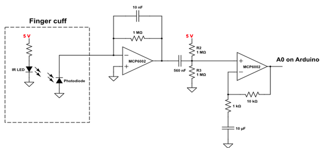

# Pax Instruments T400D Modules

## Overview
===
The first T400D modules should be devices for which there already exists an Eagle-based breakout board and Arduino library. This will facilitate rapid development.

The sales number for modules can help us determine what products to make.

We can have two types of breakouts. We can fit three small modules or one large one. We can make small modules for individual sensors. The large modules can be for functional devices that require more than one discrete component.

## Development
===
These are the development guidelines. For each module use the template files in Github to design the Eagle schematic and PCB.

We should come up with a template program for the Arduino code. It would be nice if each library were modified to output data in the same format. Then it would be pretty simple to recycle code.

### Schematic design guidelines
Schematic design will follow the guidelines listed in (a yet to be written design document). 

### PCB design guidelines
PCB design will follow the guidelines listed in (a yet to be written design document). Each module will have on the sikscreen any relevant information including

- Module name
- i2c addresses
- configuration information (e.g. jumpers to configure an i2c address)
- Pax Instruments name and logo (This should be a part in the Eagle library)
- Open hardware logo
- License information

## Discrete modules
===
Discrete modules are simple boards. Each discrete module fits in a single slot of the three available slots of the T400D development board.

Each module may have one or more ICs as long as they are intimately related. For example, a thermocouple module may have an ADC to measure voltage from the thermocouple and a seperate IC to measure junction temperature.

Prototype of the T400D development board with three perf board modules installed:  

### Alcohol gas sensor
This alcohol gas sensor is sold by Sparkfun (https://www.sparkfun.com/products/8880). From Sparkfun's description: "This alcohol sensor is suitable for detecting alcohol concentration on your breath... It has a high sensitivity and fast response time. Sensor provides an analog resistive output based on alcohol concentration. The drive circuit is very simple, all it needs is one resistor. A simple interface could be a 0-3.3V ADC."

This sensor is used in the DrinkShield Arduino (http://shieldlist.org/gfxhax/drinkshield). Eagle and Arduino source can be found at https://code.google.com/p/drinkshield/

### Real time clock
Module for the RTC used in the T400. The RTC module should also include a backkup battery.

Sample schematic from the T400:  

### SPI flash (W25Q80BV)
Module for the SPI flash used in the T400.

Sample schematic from the T400:  

### ADC (MCP3424)
Module for one of the ADC used in the T400 or T100. The ADC channels can be connected to screw terminals. Depending on how many channels we need, we can use MCP3421 (one channel), the MCP3422 (two channels) or MCP3423/MCP3424 (four channels). The MCP3421 is used in the T100 and the MCP3424 is used in the T400.

Sample schematic from the T400:  

### Single thermocouple
Module to connect a thermocouple. This shoud be based on the T100 design. It would include the mini thermocouple connector and MCP9800 junction temperature sensor from the T400 and the MCP3421 ADC from the T100.

### Temperature sensor (MCP9800)
Module for the junction temperature sensor used in the T400. If we make the single thermocouple module, this module would be redundant and we should not make it.

Sample schematic from the T400:  

### Buzzer
A simple module with a buzzer.

### Arduino to Nokia brdige
A discrete module for controlling old Nokia phones. The phone would act as a GSM modem. This would be a low cost way for a person to add GSM data capability to their project.

This would be a very simple PCB. The kit would have to include a cable.

From [Ilias Giechaskiel's project]()https://ilias.giechaskiel.com/posts/arduino_sms/index.html):

See http://hackaday.com/2015/01/01/controlling-nokia-phones-with-arduino/

### Heartbeat detector
This device optically detects a human pulse and is simple enough to be a discrete module.

[Arduino-based pulse sensor](http://hackaday.io/project/3378-diy-arduino-pulse-sensor):  

See http://hackaday.com/2015/01/11/simple-and-inexpensive-heartbeat-detector/ and http://hackaday.com/2011/02/17/fingertip-heart-rate-monitor/

## Functional devices
===

### Multiple thermocouples
A device to interfacing with as many thermocouples as possible. Use a thermocouple chip and a multiplexer to connect many thermocouples.

We can use small screw or push terminals for this. It would be nice to interface with mini thermocouples if we can stack them perpendicular to how they're stacked in the T400.

The circuitry for this device is simple, but it would take up the entire module area to achieve the maximum number of thermocouple connections.

See http://shieldlist.org/oceancontrols/tcmux

### pH meter
The circuitry to measure pH is too complex for a single discrete module, so we would have to make a functional device board. It should include the ability to read from a pH sensor, compensate using a temperature sensor, and track time using an RTC and backup battery. It may also include a buzzer for pH out-of-range alarms.

See the pHduino https://code.google.com/p/phduino/

Schematic from the pHduino:  

### Mitutoyo SPC Interface
Redesign of Zach's Mitutoyo-SPC-Interface into the T400 body. This would work best if we can make it a breakout board for the T400D development platform.

All the interfaces can share the same GND, VCC, and CLK. Each interface requires an independent REQ and DATA. We should have enough free pins if we do four channels.

===
===
===
===

### Fat analyzer
Probably not this one because it has the potental to harm a person. This must be researched further.

See http://hackaday.com/2015/01/10/diy-electrical-body-fat-analyzer/

### AVR high voltage programmer
See http://shieldlist.org/mightyohm/hvrescue and http://shieldlist.org/mightyohm/hvrescue2

### USB asp programmer
Device for programming AVR microcontrollers. With the rising popularity of ARM chips, this is probably not the best product to make.

- http://www.fischl.de/usbasp/
- http://hackaday.com/2014/11/02/inexpensive-avr-programmer-made-from-five-components/
- http://www.anthonyvh.com/2013/04/24/programming-pen-usb-interface/
- http://www.embedded-creations.com/projects/tiny-avr-jtag-programmer/

### Chip programmer
USB dongle that has a usbasp or other programmer on a PCB. Has a zip socket for QFN44 (ATmega32U4). Can have other footprints zip socket footprints. Has all the components necessary to run the chip. Maybe just a zif socket with the minimum components, use external flasher. Maybe integrate a flasher, but allow for an external flasher to be used. See http://shieldlist.org/evilmadscience/isp and http://shieldlist.org/soniktech/senpai

### Electrical conductivity measurement
See http://hackaday.com/2014/11/10/accurately-measuring-electrical-conductivity/

### USB sniffer
Passes USB through the BBB and sniff it. See http://www.elinux.org/BeagleBoard/GSoC/USBSniffer

### Multimeter wireless remote display
See http://hackaday.com/2015/02/01/give-your-multimeter-a-wireless-remote-display/

### Serial port
Adds a serial port. Maybe a good terminal for extracting data from a serial device.

- http://shieldlist.org/cutedigi/rs232
- http://shieldlist.org/linksprite/rs485

### Power supply
See http://shieldlist.org/cutedigi/negvoltage (Supplies negative voltage)

### Network analyzer
See http://hackaday.com/2015/02/09/altoids-tin-network-analyzer/

### Oscilloscope
See http://www.eevblog.com/2014/10/22/eevblog-675-how-to-reverse-engineer-a-rigol-ds1054z/

### Spectrum analyzer
See http://hackaday.com/2014/09/16/thp-quarterfinalist-3ghz-spectrum-analyzer/ and http://shieldlist.org/bliptronics/spectrum

### GPIB interface
Module to interface with GPIB devices. Maybe this would be good as a standalone reader for a particular device. With an LCD the T400D can act as a remote display for data. It could be the head for a headless GPIB device.

### Motor
Connect stepper motors, DC motors, and servos.

- http://www.adafruit.com/products/81
- http://www.adafruit.com/products/1438
- http://shieldlist.org/arduino/motor
- http://shieldlist.org/andreconcalves/hbridge
- http://shieldlist.org/emartee/motor-drive
- http://shieldlist.org/dfrobot/1a-motor
- http://shieldlist.org/dfrobot/2a-motor
- http://shieldlist.org/nkc/motor
- http://shieldlist.org/sparkfun/ardumoto
- http://shieldlist.org/sparkfun/monster-moto
- http://shieldlist.org/sparkfun/motor

### Servo tester
Connect a bunch of servos to the device. Add two screw terminals or a barrel connector to power the extra servos. Use a multiplexer to run many servos or just the available pins of the development device. See http://www.adafruit.com/products/1411

### Watt meter
See http://shieldlist.org/galileo7/wattmeter

### Electricity usage monitor
Uses Google spreadsheets. See http://hackaday.com/2015/01/15/electricity-usage-monitor-is-linked-to-google-spreadsheets/

### Smart energy sensors
See http://shieldlist.org/seg/segmeter

### Humidity and pressure datalogger
Device for measuring pressure and humidity.

### Water quality tester
See http://hackaday.com/2014/10/17/open-source-water-quality-tester/

### UV Radiometer
See https://www.sparkfun.com/products/12705

### Wind gauge
A device to measuring wind speed.

- Mini- wind gauge http://www.thingiverse.com/thing:241608
- Wind direction anemometer http://www.thingiverse.com/thing:245025
- wind gauge http://www.thingiverse.com/thing:229975

### Bee hive monitor
A device to measure temperature and humidity of bee hive. May include an event counter to monitor bee entry and exit.

### Weather station
- Stevenson screen for weather station http://www.thingiverse.com/thing:158039
- Weather station http://www.thingiverse.com/thing:144665
- W ented and shaded box http://www.thingiverse.com/thing:146132
- Stevenson screen for wireless meteorological sensor http://www.thingiverse.com/thing:83969

### Outdoor air pressure sensor
See http://www.thingiverse.com/thing:193569

### Water softener level detector
See http://hackaday.com/2014/10/29/water-softener-level-detector-keeps-you-out-of-trouble-with-wife/

### Rain meter
See http://www.thingiverse.com/thing:13383

### Brew monitor
- http://hackaday.com/2012/10/01/brewpi-is-a-raspberry-pi-in-charge-of-beer-fermentation/
- http://hackaday.com/2014/10/11/keep-an-eye-on-your-fermenting-beer-with-brewmonitor/

### Coffee roasting controller
See http://shieldlist.org/homeroasters/tc4

### Bluetooth low enerby (BLE)
See http://hackaday.com/2014/10/20/weightless-thing-for-oct-20-0100/ and http://shieldlist.org/mkroll/ble

### Geiger counter
See http://hackaday.com/2014/10/25/use-a-cheap-pin-diode-as-a-geiger-counter/ and http://shieldlist.org/libelium/radiation

### Dolly controller
Camera and dolly control

- http://shieldlist.org/dreamingrobots/camera-axe-5 (camera controller)
- http://shieldlist.org/dynamicperception/dolly (dolly controller)

### Video overlay
See http://shieldlist.org/lowvoltagelabs/videooverlay

### TV output
See http://shieldlist.org/batsocks/tellymate

### Intervalometer
See http://hackaday.com/2014/11/16/100-diy-intervalometer-is-100-awesome/

### Smoke detector
See http://shieldlist.org/cutedigi/smoke

### Sonar
See http://hackaday.com/2015/01/26/sonar-built-from-piezo-and-microphone/

### Inclinometer
See http://hackaday.com/2014/12/16/create-an-inclinometer-using-a-raspberry-pi/

### Random number generator
- http://hackaday.com/2014/10/31/dual-mode-avalanche-and-rf-random-number-generator/
- http://ubld.it/products/truerng-hardware-random-number-generator/
- http://www.entropykey.co.uk/
- http://en.wikipedia.org/wiki/Comparison_of_hardware_random_number_generators

### Spectrometer
See http://www.thingiverse.com/thing:148270 and http://myspectral.com/

### Ultrasonic rangefinder
See http://hackaday.com/2014/12/22/green-sweep-for-your-ultrasonic-rangefinder/

### Colorimeter
See http://www.appropedia.org/Open-source_colorimeter

### IR communication
Act as a TV-be-gone or general IR remote. See http://shieldlist.org/linksprite/infrared

### 433 MHz receiver
See http://shieldlist.org/freetronics/433mhzreceiver

### GPS/GSM/GPRS
Log GPS.

- http://www.adafruit.com/products/98
- http://www.adafruit.com/products/1272
- http://shieldlist.org/cutedigi/gprs-gsm (with gsm)
- http://shieldlist.org/antrax/gsm-gprs-gps
- http://shieldlist.org/dss-circuits/i2c-gps
- http://shieldlist.org/dexter/gps
- http://shieldlist.org/liquidware/geoshield
- http://shieldlist.org/libelium/gprs-dualband
- http://shieldlist.org/libelium/gprs-quadband
- http://shieldlist.org/libelium/gps
- http://shieldlist.org/hwkitchen/gsmplayground
- http://shieldlist.org/geekonfire/gprs
- http://shieldlist.org/futuraelettronica/gsm
- http://shieldlist.org/openelectronics/gsm900
- http://shieldlist.org/mitek/gsm-gps
- http://shieldlist.org/mci-electronics/gm862
- http://shieldlist.org/sparkfun/gps
- http://shieldlist.org/sparkfun/cellular
- http://shieldlist.org/seeedstudio/gprs

### Radio

- http://shieldlist.org/argent/radio
- http://shieldlist.org/sparkfun/am-fm-receiver
- http://shieldlist.org/skpang/easyradio

### FM transmitter
See http://hackaday.com/2014/11/12/2-fm-transmitter-for-rasberry-pi/ and http://shieldlist.org/curious-inventor/fm-radio

### Software-defined transceiver
- http://hackaday.io/project/1538-portablesdr
- http://hackaday.com/2014/11/05/hackaday-prize-finalist-a-portablesdr/

### Software defined radio
See http://hackaday.com/2015/01/14/portablesdr-makes-it-to-kickstarter/ and http://hackaday.com/2015/01/30/casing-up-the-teensy-sdr/ and http://hackaday.com/2014/11/19/rtl-sdr-as-a-spectrum-analyzer/ and http://hackaday.com/2015/02/09/portablesdr-needs-a-cinderella-story-to-finish-its-kickstarter/

### Analog input
See http://shieldlist.org/appliedplatonics/analoginput

### CAN bus interface

- http://shieldlist.org/fazjaxton/can
- http://shieldlist.org/sparkfun/can-bus
- http://shieldlist.org/skpang/canbus

### GPIO
See http://shieldlist.org/futuraelettronica/io

### Current-based sensors
See http://shieldlist.org/mci-electronics/20ma

### Datalogger
A general purpose datalogger. Includes an SD card, RTC, and prototyping perfboard area.

- http://www.adafruit.com/products/243
- http://www.adafruit.com/products/249
- http://www.adafruit.com/products/1141
- http://shieldlist.org/chipstobits/storage
- http://shieldlist.org/ethermania/weathershield1
- http://shieldlist.org/nuelectronics/datalog-io
- http://shieldlist.org/snootlab/memoire
- http://shieldlist.org/seeedstudio/stalker

### Screw terminals
Just breakout the pins to screw terminals or other type of quick connector.

- http://www.adafruit.com/products/196
- http://shieldlist.org/criticalvelocity/terminalblock

### Low noise datalogger
See http://hackaday.com/2015/01/21/sigzig-data-loggers-ditch-the-noise-while-pimping-the-case/

### Inertial measurement unit (IMU)
See http://shieldlist.org/criticalvelocity/imu

### Accelerometer
See http://shieldlist.org/criticalvelocity/accelerometer

### USB host

- http://shieldlist.org/circuitsathome/usbhost
- http://shieldlist.org/circuitsathome/usbhost-v2
- http://shieldlist.org/sparkfun/usbhost

### Barcode reader
See http://www.adafruit.com/product/1202
Device that
