# Pax Instruments T400D Modules

## Overview
===
The first T400D modules should be devices for which there already exists an Eagle-based breakout board and Arduino library. This will facilitate rapid development.

The sales number for modules can help us determine what products to make.

We can have two types of breakouts. We can fit three small modules or one large one. We can make small modules for individual sensors. The large modules can be for functional devices that require more than one discrete component.

## Development
===
These are the development guidelines. For each module use the template files in Github to design the Eagle schematic and PCB.

We should come up with a template program for the Arduino code. It would be nice if each library were modified to output data in the same format. Then it would be pretty simple to recycle code.

### Schematic design guidelines
Schematic design will follow the guidelines listed in (a yet to be written design document). 

### PCB design guidelines
PCB design will follow the guidelines listed in (a yet to be written design document). Each module will have on the sikscreen any relevant information including

- Module name
- i2c addresses
- configuration information (e.g. jumpers to configure an i2c address)
- Pax Instruments name and logo (This should be a part in the Eagle library)
- Open hardware logo
- License information
- Arduino pinmap

## Discrete modules
===
Discrete modules are simple boards. Each discrete module fits in a single slot of the three available slots of the T400D development board.

Each module may have one or more ICs as long as they are intimately related. For example, a thermocouple module may have an ADC to measure voltage from the thermocouple and a seperate IC to measure junction temperature.
A good discrete module candidate will meet the following criteria.

- All components will fit onto a single discrete module board
- All components that do not need to be outside the enclosure can be housed within the enclosure
- The enclosure can be properly assembled with the module in place
- The module does not interfere with neighboring modules, the main PCB, or the enclosure
- The module can be operated at 3.3V or with a boot converter on the module operating with a 3.3V input
- The module can have anu number of i2c devices
- The module can require up to one of either a lot device, analog output to MCU, or digital output to MCU
- The module requires no more than one SPI device
- There exists Arduino libraries for all module ICs
- There exists Eagle files for all IC components

How do we decide which modules we make first?

Tier | Description | Example
---|---|---
1 | Direct sensing functionality | Humidity sensor, light sensor
2 | Auxiliary functionality | flash storage, radio transciever
3 | | 

Prototype of the T400D development board with three perf board modules installed:  
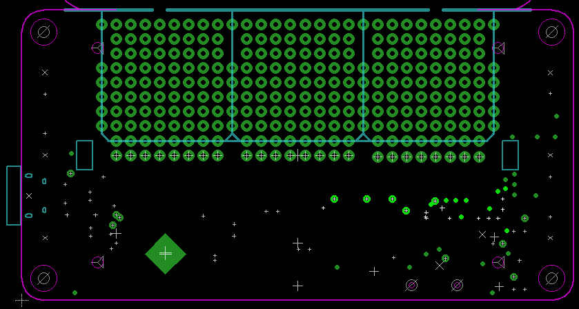

We may want to brekaout VBUS or other power source to the side of the module area. We may want to make modules that draw more power than the 3.3V regulator can provide.

### Module pinout
Each module has the same connector. The ports will have DATA1, DATA2, and DATA3 as the CS pins. the space between module one and module two will have DATA4. The space between module two and module three will have DATA5 (formerly, TXLED). With this configuration DATA4 and DATA5 will be broken out for full size modules. They will also be available for breadboarding if the user adds a header across all twenty-six module pins.

Port pin | Function
---|---
1 | 3.3V
2 | GND
3 | SDA
4 | SCL
5 | MISO
6 | MOSI
7 | SCK
8 | DATA<1,2,3>

### Physical constraints
The distance between the PCB and the LCD is 4.7 mm. The distance between the PCB and the battery compartment is at least 1 mm.

The enclosure is designed around a 1.6 mm thick PCB.

### Alcohol gas sensor
__Status:__  In discovery phase  
__Evaluation:__ Good candidate  
__Requirements:__  Will likely require the sensor be mounted on the top panel PCB.

This alcohol gas sensor is sold by Sparkfun. From Sparkfun's description: "This alcohol sensor is suitable for detecting alcohol concentration on your breath... It has a high sensitivity and fast response time. Sensor provides an analog resistive output based on alcohol concentration. The drive circuit is very simple, all it needs is one resistor. A simple interface could be a 0-3.3V ADC."

This would probably require a ninety degree PCB on the top panel.

Simple schematic for similar snesor:  
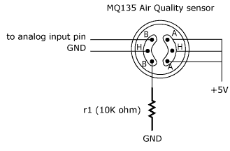

See https://www.sparkfun.com/products/8880, http://shieldlist.org/gfxhax/drinkshield and https://code.google.com/p/drinkshield/

### Smoke detector
__Status:__  In discovery phase  
__Evaluation:__ Good candidate  
__Requirements:__  Will likely require the sensor be mounted on the top panel PCB.

Discrete module to interface with a smoke detector sensor.

Simple schematic for similar snesor:  

See http://shieldlist.org/cutedigi/smoke

### Endocer
__Status:__  In discovery phase  
__Evaluation:__ Not a good early product
__Requirements:__  To be useful we may want to have the encoder on a cable.

Discrete module that detects rotary or other encoding. We can only do this if we have interrup pins on for each module. This would be simple to implement. However, this component is not well aligned with the concept of lab instrumentation.

### 433/434/315 MHz receiver
__Status:__  In discovery phase  
__Evaluation:__ Poor candidate  
__Requirements:__ To be useful this require a transmitter.

Discrete module for radio transmitting/receiving. The transmitters are smaller than the receivers, so that may be the best module to start with.

There are modules we can drop onto a breakout board, but we may be better designing our own module.

434 MHz transmitter form Sparkfun:  
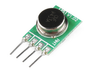

See http://shieldlist.org/freetronics/433mhzreceiver and https://www.sparkfun.com/products/10534

The receiver is not terribly userful unless we also have a transmitter. These appear rather large for our module size.

### Humidity sensor
__Status:__  In discovery phase  
__Evaluation:__ Good candidate
__Requirements:__  

Discrete module to interface with a humidity sensor.

HTU21D breakout from Sparkfun:  
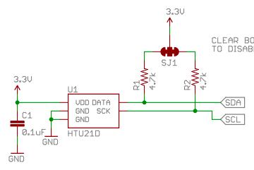

See https://www.sparkfun.com/products/8257 and https://www.sparkfun.com/products/12064

### Pressure sensor
__Status:__  In discovery phase  
__Evaluation:__ Good candidate  
__Requirements:__  

Discrete module to interface with a pressure sensor. Can connect via cable to another PCB with the pressure sensor. Then the user can mount it wherever they like.

MPL3115A2 from Sparkfun:  
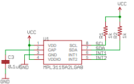

See https://www.sparkfun.com/products/8257

### Accelerometer
__Status:__  In discovery phase  
__Evaluation:__ Poor  
__Requirements:__  

Discrete module to breakout an accelerometer IC. The IC may include a gyroscope. This would be a simple breakout board. We would need some lab instrument use cases for this to be a good module candidate.

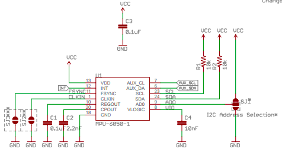

See http://shieldlist.org/criticalvelocity/accelerometer, https://www.sparkfun.com/products/9836, and https://www.sparkfun.com/products/11028

### Perf board
__Status:__  In discovery phase  
__Evaluation:__ Good candidate  
__Requirements:__  

Simple module with a perfboard pattern.

Three perfboard modules installed in a prototype of the T400D:  
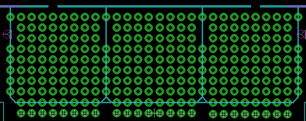

### Surface mount protoboard
__Status:__  In discovery phase  
__Evaluation:__ Good candidate
__Requirements:__ Must be tested. I have not used this typ of protoboard.

We can make breakout modules for various surface mount footprints. The remaining area can be a series of SMT pads such that passive components can be mounted to the board and traces made by dridging with solder.

The split vias along the edges can be used to connect from one side to another.

Here is what the patter can look like:  
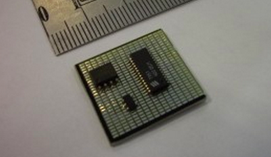

### Real time clock
__Status:__  In discovery phase  
__Evaluation:__ Good candidate  
__Requirements:__  

Module for the RTC used in the T400. The RTC module should also include a backkup battery.

Sample schematic from the T400:  
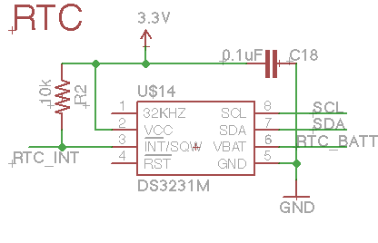

### SPI flash (W25Q80BV)
__Status:__  In discovery phase  
__Evaluation:__ 
__Requirements:__  

Module for the SPI flash used in the T400.

Sample schematic from the T400:  
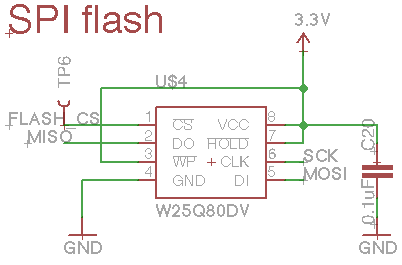

### PWM driver
Discrete module that gives one or more PWM outputs that can control servo motors, LED's, or other devices.

See http://www.adafruit.com/product/815

### Bluetooth low energy (BLE)
It would be great to have a BLE module as a discrete module. We'll have to do more research to determine what is out there right now. This space is moving quickly.

See http://hackaday.com/2014/10/20/weightless-thing-for-oct-20-0100/ and http://shieldlist.org/mkroll/ble

### ADC (MCP3424)
__Candidacy:__ good

Module for one of the ADC used in the T400 or T100. The ADC channels can be connected to screw terminals. Depending on how many channels we need, we can use MCP3421 (one channel), the MCP3422 (two channels) or MCP3423/MCP3424 (four channels). The MCP3421 is used in the T100 and the MCP3424 is used in the T400.

Sample schematic from the T400:  
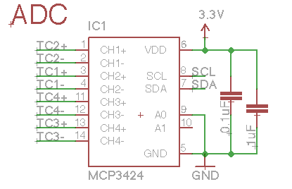

### Inertial measurement unit (IMU)
A discrete module that incorporates several ICs that are typically used in an IMU.

See http://shieldlist.org/criticalvelocity/imu

### UV Radiometer
Module for measuring UV light. This can be be a sensor on the T400D device or a module that interfaces with another PCB via cable, so the sensor can be mounted where the user likes.

See https://www.sparkfun.com/products/12705

### IR communication
Simple discrete module that provides IR communication hardware. With the right software it can act as a TV-be-gone or general IR remote. See http://shieldlist.org/linksprite/infrared

### Single thermocouple
__Candidacy:__ sufficient

Module to connect a thermocouple. This shoud be based on the T100 design. It would include the mini thermocouple connector and MCP9800 junction temperature sensor from the T400 and the MCP3421 ADC from the T100.

### Temperature sensor (MCP9800)
__Candidacy:__ good

Module for the junction temperature sensor used in the T400. If we make the single thermocouple module, this module would be redundant and we should not make it.

Sample schematic from the T400:  
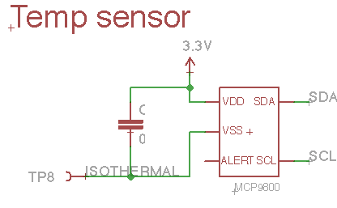

### Screw terminals
Discrete module with srew terminals and perfboard. Connections can be routed by the hacker. Just breakout the pins to screw terminals or other type of quick connector.

See http://www.adafruit.com/products/196 and http://shieldlist.org/criticalvelocity/terminalblock

### Buzzer
__Candidacy:__ good

A simple module with a buzzer.

We can get fancy and run the buzzer via the 3.3V line.
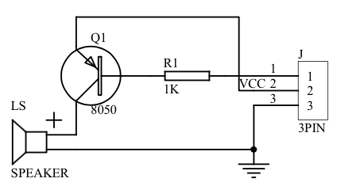

### Arduino to Nokia brdige
A discrete module for controlling old Nokia phones. The phone would act as a GSM modem. This would be a low cost way for a person to add GSM data capability to their project.

This would be a very simple PCB. The kit would have to include a cable.

From [Ilias Giechaskiel's project]()https://ilias.giechaskiel.com/posts/arduino_sms/index.html):
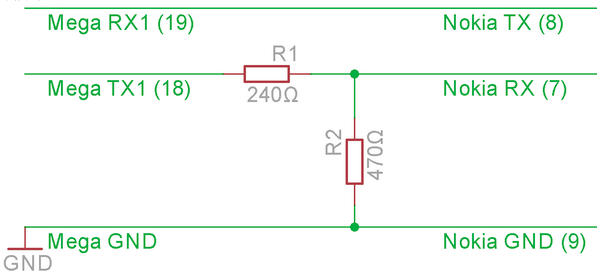

See http://hackaday.com/2015/01/01/controlling-nokia-phones-with-arduino/ and http://murchlabs.com/send-sms-from-your-arduino/

### Heartbeat detector
This device optically detects a human pulse and is simple enough to be a discrete module.

[Arduino-based pulse sensor](http://hackaday.io/project/3378-diy-arduino-pulse-sensor):  
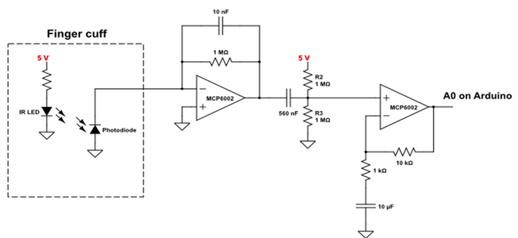

See http://hackaday.com/2015/01/11/simple-and-inexpensive-heartbeat-detector/ and http://hackaday.com/2011/02/17/fingertip-heart-rate-monitor/

### Analog input
Discrete module that provides one or more analog input channels

See http://shieldlist.org/appliedplatonics/analoginput

### DAC`	 	
Discrete module that outputs one or more analog signals via a digital-to-analog converter.

### GPIO
Discrete module that provides one or more general purpose I/O ports. These ports may be hardened against input voltage. We can achieve having more than one I/O channel per module by using an expander IC.

See http://shieldlist.org/futuraelettronica/io and http://www.digitalsmarties.net/products/expander-plug

### Current-based sensors
Discrete module to interface with one or more sensors that output a current-based signal between 4 mA and 20 mA. These types of sensors are typically found in industrial applications.

See http://shieldlist.org/mci-electronics/20ma

### Camera trigger
Module to trigger a camera.

### Light sensor
Module that can detect light. It should be fast enough such that it can be used in a camera triggering device.

### Sound sensor
Module that can detect sound. It should be fast enough such that it can be used in a camera triggering device.

### Current sensor
Module to interface with AC current sensors.

See http://shieldlist.org/galileo7/wattmeter and http://shieldlist.org/seg/segmeter

### TV output
Module to output to a black and white television in NTSC or PAL formats.

See http://shieldlist.org/batsocks/tellymate

### GPS
Discrete module for a GPS receiver.

See http://www.adafruit.com/products/98, http://www.adafruit.com/products/1272, http://shieldlist.org/dexter/gps, http://shieldlist.org/libelium/gps, http://shieldlist.org/sparkfun/gps, http://shieldlist.org/liquidware/geoshield, http://shieldlist.org/mitek/gsm-gps, http://shieldlist.org/dss-circuits/i2c-gps, http://shieldlist.org/antrax/gsm-gprs-gps, http://shieldlist.org/cutedigi/gps-sd

### GSM
Discrete module for connecting to a SIM card and GSM network.

See http://shieldlist.org/seeedstudio/gprs, http://shieldlist.org/sparkfun/cellular, http://shieldlist.org/mci-electronics/gm862, http://shieldlist.org/mitek/gsm-gps, http://shieldlist.org/openelectronics/gsm900, http://shieldlist.org/futuraelettronica/gsm, http://shieldlist.org/geekonfire/gprs, http://shieldlist.org/hwkitchen/gsmplayground, http://shieldlist.org/libelium/gprs-quadband, http://shieldlist.org/libelium/gprs-dualband, http://shieldlist.org/antrax/gsm-gprs-gps, http://shieldlist.org/cutedigi/gprs-gsm

### Servo
Module for connecting to one or more servos. Each module port has a single chip select pin, so we would need a multiplexing device if we want ot connect more than one servo.

See http://www.adafruit.com/products/1411

### Stepper/DC motor
Module to interface with a stepper motor. Not sure what connector type. Maybe have screw terminals for connecting bare wires.

See http://www.adafruit.com/products/81, http://www.adafruit.com/products/1438, http://shieldlist.org/arduino/motor, http://shieldlist.org/andreconcalves/hbridge, http://shieldlist.org/emartee/motor-drive, http://shieldlist.org/dfrobot/1a-motor, http://shieldlist.org/dfrobot/2a-motor, http://shieldlist.org/nkc/motor, http://shieldlist.org/sparkfun/ardumoto, http://shieldlist.org/sparkfun/monster-moto, http://shieldlist.org/sparkfun/motor

### FM receiver
Module to receive FM radio signals. I think we can get a small basic module.

- http://shieldlist.org/argent/radio
- http://shieldlist.org/sparkfun/am-fm-receiver
- http://shieldlist.org/skpang/easyradio

### FM transmitter
Module to send FM radio signals. I think we can get a small basic module.

See http://hackaday.com/2014/11/12/2-fm-transmitter-for-rasberry-pi/ and http://shieldlist.org/curious-inventor/fm-radio

## Functional devices
===

### Multiple thermocouples
A device to interfacing with as many thermocouples as possible. Use a thermocouple chip and a multiplexer to connect many thermocouples.

We can use small screw or push terminals for this. It would be nice to interface with mini thermocouples if we can stack them perpendicular to how they're stacked in the T400.

The circuitry for this device is simple, but it would take up the entire module area to achieve the maximum number of thermocouple connections.

See http://shieldlist.org/oceancontrols/tcmux

### Electrical conductivity meter
See http://hackaday.com/2014/11/10/accurately-measuring-electrical-conductivity/

Sparkey's Widgets makes a small conductivity interface (https://www.sparkyswidgets.com/product/miniec-ec-interface/). It looks pretty small. Maybe we can make a discrete module with this.

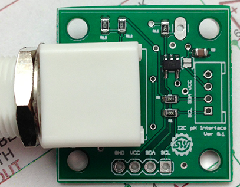

### pH meter
The circuitry to measure pH is too complex for a single discrete module, so we would have to make a functional device board. It should include the ability to read from a pH sensor, compensate using a temperature sensor, and track time using an RTC and backup battery. It may also include a buzzer for pH out-of-range alarms.

See the pHduino https://code.google.com/p/phduino/

Schematic from the pHduino:  
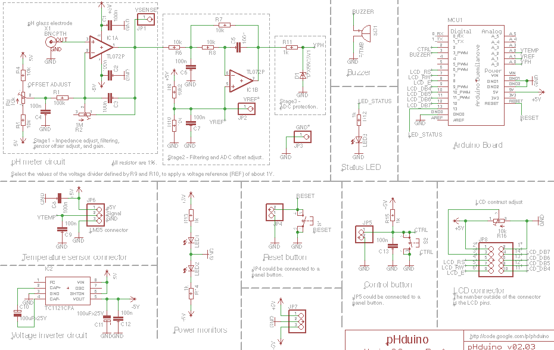

Upon further investigation, sparkyswidgets.com makes a pH interface (https://www.sparkyswidgets.com/product/miniph/) that seems pretty small. Maybe we can use that and make a discrete module.
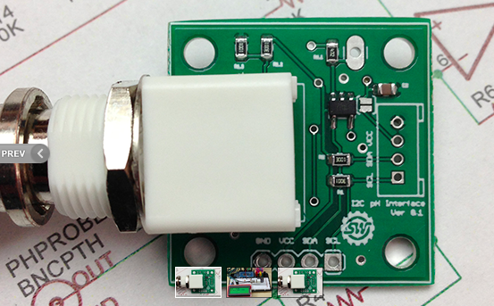

### USB power meter
A device that will display and log the voltage, current, power, and energy used by a USB device. Has a USB-A and USB-B connector. The data and ground lines are passed directly between the USB connectors the +5V passes through a measurment circuit to measure current and voltage from which power and energy can be derived.

See http://friedcircuits.us/docs/usb-tester-oled-backpack/

### Mitutoyo SPC Interface
Redesign of Zach's Mitutoyo-SPC-Interface into the T400 body. This would work best if we can make it a breakout board for the T400D development platform.

All the interfaces can share the same GND, VCC, and CLK. Each interface requires an independent REQ and DATA. We should have enough free pins if we do four channels.

### Coffee roasting controller
A device for roasting coffee. We should make this as compatible as possible with the TC4 device. The guy isn't releasing the Eagle file, only PDFs.

The TC4 shield plus Arduino is pretty much a T400 with some extra i/o. I think we can fit the design within the full module area.

TC4 photo:  
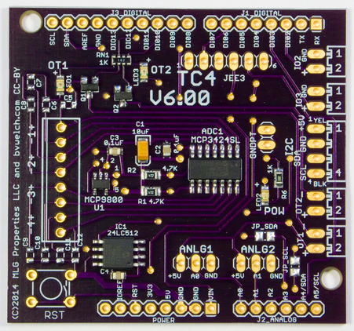

See http://shieldlist.org/homeroasters/tc4

### CAN bus interface
A device that can interface with the automotive CAN bus. With the right software it can act as an OBD-II trouble code reader. Maybe also a display for automotive data. Use a DB9 connector like the Sparkfun shield for use with a OBD-II interface cable. If it weren't for the phisical size, we could probably get this on a discrete module.

See http://shieldlist.org/fazjaxton/can, https://www.sparkfun.com/products/10039, and http://shieldlist.org/skpang/canbus.

### Video overlay
Device that will overlay text into a video. Input RCA video and output RCA video with overlay. Fun to play with, but probably not terribly userful.

See http://lowvoltagelabs.com/products/videooverlayshield/

### GPIB interface
Module to interface with GPIB devices. Maybe this would be good as a standalone reader for a particular device. With an LCD the T400D can act as a remote display for data. It could be the head for a headless GPIB device.

This would be good for interfacing with old lab instruments. I think we would be better off making a GPIB to USB interface. It's already been done before, so it ay not be a good product for us. If we make a functional device module, we can talk to GPIB devices with the T400D and also interface over USB.

See http://dev.hackaday.com/?p=73119 and http://scasagrande.blogspot.ca/2012/04/gpibusb-for-sale.html

### Power supply
Digital power supply. It should probably take power directly from VBUS and boost it up to 5V even if the T400D is plugged into USB power. The output voltage should be programmable through the LCD and buttons. The current, voltage, power, and energy should be logged to the SD card. The device should be able to operate on battery power. It would be cool if we can output negative voltage too.

See http://shieldlist.org/cutedigi/negvoltage

### Serial port
Nothing special. Just a discrete module that adds a serial port. Maybe a good terminal for extracting data from a serial device.

A DB9 connector is approximately 31 mm wide while our modules are 22.86 mm wide. A D-sub9 connector will not work for this. We could add two serial ports with some level shifting and maybe even RS485 chips and call it a serial port functional device.

See http://shieldlist.org/cutedigi/rs232 and http://shieldlist.org/linksprite/rs485.

### Random number generator
A module that generates random numbers. From the project linked below I'm pretty sure we can make this module sized.

See http://hackaday.com/2014/10/31/dual-mode-avalanche-and-rf-random-number-generator/, http://ubld.it/products/truerng-hardware-random-number-generator/, http://www.entropykey.co.uk/, http://en.wikipedia.org/wiki/Comparison_of_hardware_random_number_generators

### Ultrasonic rangefinder
Functional device that uses the prolific ultrasonic range finding circuit.

See http://hackaday.com/2014/12/22/green-sweep-for-your-ultrasonic-rangefinder/

### Standalone AVR  programmer
A device that can program AVR boards via an ICSP header without being connected to a computer. The user selects a hex file from the SD card via the LCD/keypad interface. Selectable between 3.3V and 5V.

The Easy Auto Programmer is the most promising design, but I cannot get the source code to compile.

See http://www.solderlab.de/index.php/hardware/auto-programmer, http://mdiy.pl/uprog-maly-szybki-przenosny-programator-avr-z-sd/?lang=en, http://hackaday.com/2014/04/11/ispnub-a-stand-alone-avr-in-system-programmer-module/, http://forum.arduino.cc/index.php?topic=125248.0

### Network analyzer
A device typically used for measuring RF filters. We can probably fit this in the module area.

See http://hackaday.com/2015/02/09/altoids-tin-network-analyzer/

### Spectrum analyzer
Device for analyzing RF frequencies. We may be able to make a simple one.

See http://hackaday.com/2014/09/16/thp-quarterfinalist-3ghz-spectrum-analyzer/, and http://shieldlist.org/bliptronics/spectrum

### Fermentation monitor
Device for monitoring and controlling a fermentation process.

See  http://hackaday.com/2012/10/01/brewpi-is-a-raspberry-pi-in-charge-of-beer-fermentation/ and http://hackaday.com/2014/10/11/keep-an-eye-on-your-fermenting-beer-with-brewmonitor/

### Intervalometer
Device that uses a timer, light sensor or sound  sensor to trigger a camera.

See http://hackaday.com/2014/11/16/100-diy-intervalometer-is-100-awesome/ and http://shieldlist.org/dreamingrobots/camera-axe-5

### Camera dolly controller
Device for timelapse and videography. Controls a camera dolly. Includes a camera trigger motor controller, inputs for encoders and endstops.

See http://shieldlist.org/dynamicperception/dolly

## Inspiration resources
===
There are many companies that make sensors and datalogging kits for educaiton and professional labs. These can be good sources of inspiration when determining what sensors may be interesting to users.

### EDU-LAB
[http://www.edulab.com/](http://www.edulab.com/)

This UK-based company sells a series of sensors and lab instruments primarily for educational use.

### Pasco
[http://www.pasco.com/](http://www.pasco.com/)

This company makes sensors and datalogging equimpent to educaiton.

### Vernier
[http://www.vernier.com/](http://www.vernier.com/)

This company makes sensors and datalogging equimpent to educaiton.

